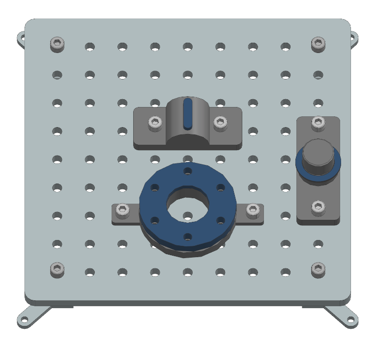

# Pick and Place Tasks

This folder contains 3D-printable files for the "Pick and Place" tasks, which are part of the Industrial Assembly Task Board. These tasks are designed to evaluate a robot's ability to handle and position various components accurately, a critical skill in industrial assembly operations.

## Tasks Overview

1. **Task 1: Housing**
   - Involves picking up and placing a housing component onto a designated location.
   - Tests the robot's ability to handle larger components with precision.

2. **Task 2: Feather Key**
   - Requires picking up and placing a feather key into a slot.
   - Evaluates the robot's capability to handle small, elongated components and align them correctly.

3. **Task 3: Shim Ring**
   - Involves picking up and placing a shim ring onto a shaft or surface.
   - Challenges the robot to manage thin, flexible components with care.

## How to Use

1. Navigate to the subfolder for the specific task you want to build.
2. Use the provided 3D-printable files to fabricate the components.
3. Follow the assembly instructions in the documentation to set up the task.

## Contributing

If you have ideas for additional "Pick and Place" tasks, please contribute by:

1. Creating the necessary 3D-printable files.
2. Writing a task description and success criteria.
3. Opening a Pull Request in the [main repository](https://github.com/WBK-Robotics/industrial-assembly-taskboard).

Your contributions will help expand the benchmark and advance robotic assembly systems.