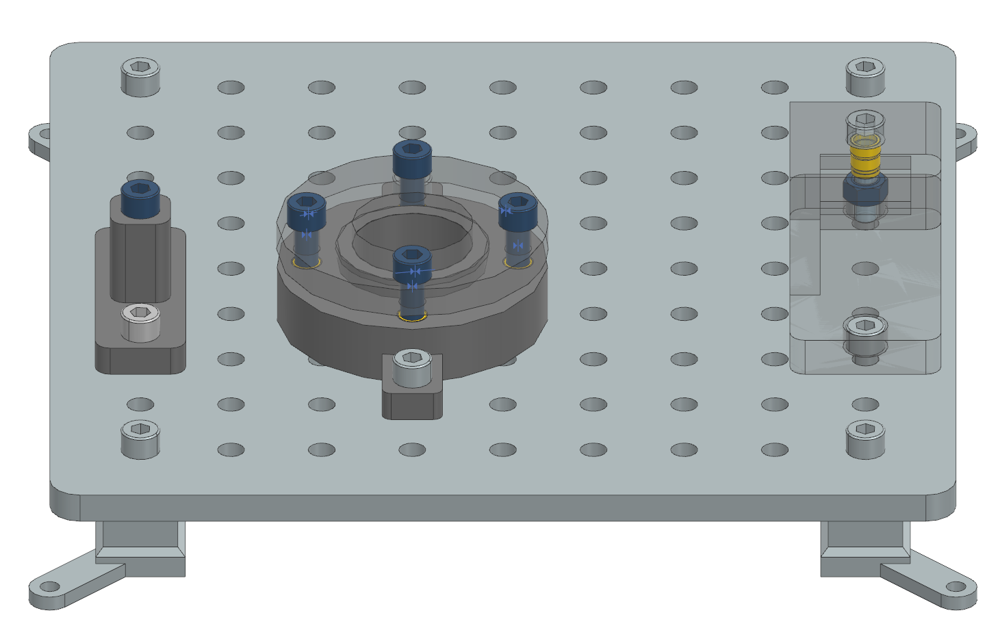

# Screws and Nuts Tasks

This folder contains 3D-printable files for the "Screws and Nuts" tasks, which are part of the Industrial Assembly Task Board. These tasks are designed to evaluate a robot's ability to handle and assemble screws and nuts in scenarios that simulate real-world industrial challenges, such as difficult accessibility and tilting.

## Tasks Overview

1. **Task 1: Hexagon Socket Screw**
   - Involves inserting and tightening a hexagon socket screw into a threaded hole.
   - Tests the robot's ability to handle standard screw insertion and tightening operations.

2. **Task 2: Nut with Difficult Accessibility**
   - Requires placing and tightening a nut in a location with limited accessibility.
   - Evaluates the robot's capability to handle constrained environments and precise positioning.

3. **Task 3: Tilting of Screws**
   - Involves inserting and tightening screws that are initially tilted or misaligned.
   - Challenges the robot to correct the alignment and ensure proper assembly.

## How to Use

1. Navigate to the subfolder for the specific task you want to build.
2. Use the provided 3D-printable files to fabricate the components.
3. Follow the assembly instructions in the documentation to set up the task.

## Contributing

If you have ideas for additional "Screws and Nuts" tasks, please contribute by:

1. Creating the necessary 3D-printable files.
2. Writing a task description and success criteria.
3. Opening a Pull Request in the [main repository](https://github.com/WBK-Robotics/industrial-assembly-taskboard).

Your contributions will help expand the benchmark and advance robotic assembly systems.