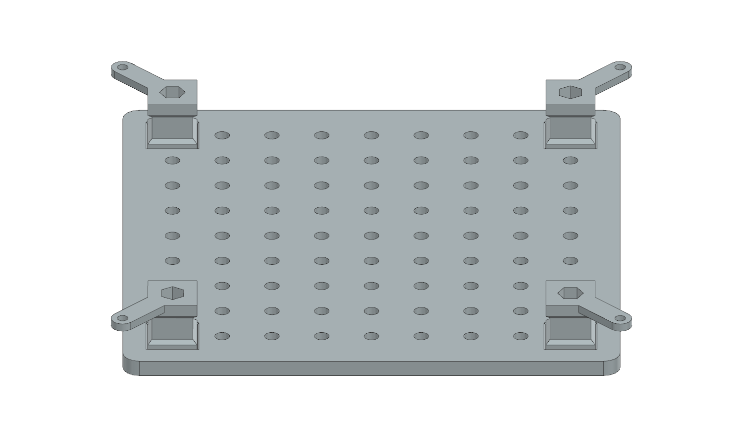
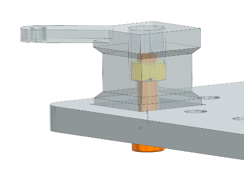
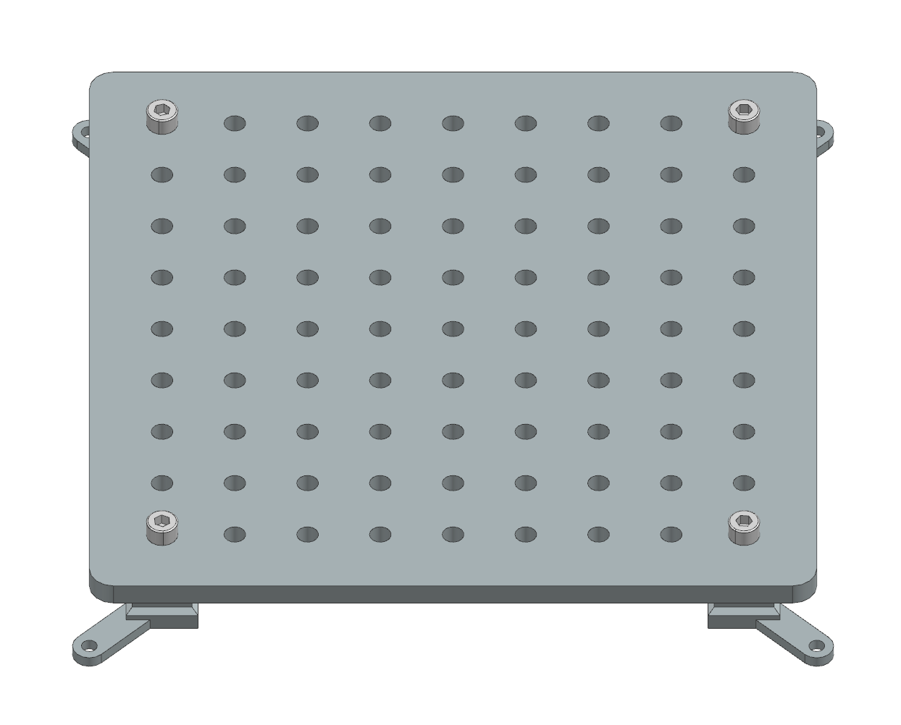

Assembling Instructions: Task board
===================================

Step 1: Prepare the Components
^^^^^^^^^^^^^^^^^^^^^^^^^^^^^^

.. list-table::
   :header-rows: 1
   :widths: 50 50

    * - 3D-printed parts:
      - Purchased hardware:
    * - Taskboard x 1 (Material: PETG)
      - M8 Nut x 4
    * - Taskboard Foot x 4 (Material: PETG)
      - 30mm M8 Screw x 4

Step 2: Position the Task Board
^^^^^^^^^^^^^^^^^^^^^^^^^^^^^^^

Place the 3D-printed task board upside down.
Ensure that the four rectangular holes are visible.

Step 3: Placing the Feet
^^^^^^^^^^^^^^^^^^^^^^^^

Insert each task board foot into one of the rectangular holes.
Make sure the small bar for fixation is pointing away from the center.

Step 4: Secure the Feet with Screws
^^^^^^^^^^^^^^^^^^^^^^^^^^^^^^^^^^^

Place an M8 nut in the hexagonal hole on the bottom of the foot.
Lift the board and insert a 30mm M8 screw through the hole on the opposite side.
Begin tightening the screw, ensuring it properly connects with the nut.
Repeat this process for all four feet.

