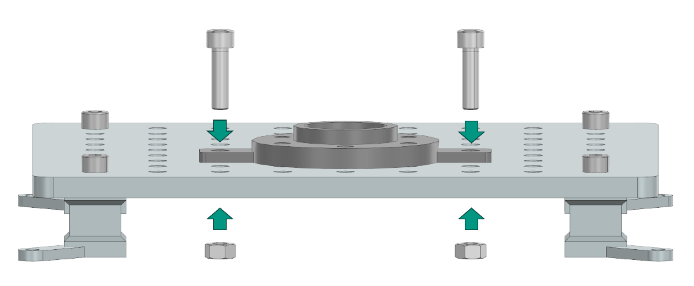

Assembly Instructions: Pick and Place
=====================================

This page describes the assembly instructions for the Pick and Place task module of the industrial assembly challenge taskboard. 
The module consists of three tasks: Housing Parts, Feather Key, and Shim Ring placement.

Task 1: Housing Parts
---------------------

Step 1: Prepare the Components
^^^^^^^^^^^^^^^^^^^^^^^^^^^^^^

.. list-table::
    :header-rows: 1
    :widths: 50 50

    * - 3D-printed parts
      - Purchased components
    * - Housing Part1 × 1 (Material: PETG)
      - M8 Nut × 2
    * - Housing Part2 × 1 (Material: PETG)
      - 30mm M8 Screw × 2

Step 2: Manual Fixation of the Housing Part1 on the Taskboard
^^^^^^^^^^^^^^^^^^^^^^^^^^^^^^^^^^^^^^^^^^^^^^^^^^^^^^^^^^^^^

Align the two side holes of the Housing Part1 component with any two suitable holes on the Taskboard. Then push two 30mm M8 screws through the aligned holes and secure them from the bottom of the Taskboard with M8 nuts.

Place the Housing Part2 on a flat surface next to the Taskboard, so that the Robot can grasp it.

Task 2: Feather Key
-------------------

Step 1: Prepare the Components
^^^^^^^^^^^^^^^^^^^^^^^^^^^^^^

.. list-table::
    :header-rows: 1
    :widths: 50 50

    * - 3D-printed parts
      - Purchased components
    * - Feather Key Assembly × 1 (Material: PETG)
      - M8 Nut × 2
    * - Feather key × 1 (Material: PETG)
      - 30mm M8 Screw × 2

Step 2: Manual Fixation of the Feather Key Assembly on the Taskboard
^^^^^^^^^^^^^^^^^^^^^^^^^^^^^^^^^^^^^^^^^^^^^^^^^^^^^^^^^^^^^^^^^^^^

Align the two side holes of the Feather Key Assembly component with any two suitable holes on the Taskboard. Then push two 30mm M8 screws through the aligned holes and secure them with M8 nuts.
Place the Feather Key on a flat surface next to the Taskboard.

Task 3: Shim Ring
-----------------

Step 1: Prepare the Components
^^^^^^^^^^^^^^^^^^^^^^^^^^^^^^

.. list-table::
    :header-rows: 1
    :widths: 50 50

    * - 3D-printed parts
      - Purchased components
    * - Shim Ring Assembly × 1 (Material: PETG)
      - M8 Nut × 2
    * - Shim Ring Magazine × 1 (Material: PETG)
      - 30mm M8 Screw × 2
    * - Shim Ring × 5
      - 

Step 2: Manual Assembly of the Shim Ring Task
^^^^^^^^^^^^^^^^^^^^^^^^^^^^^^^^^^^^^^^^^^^^^

Align the two side holes of the Shim Ring Assembly component with any two suitable holes on the Taskboard. Then push two 30mm M8 screws through the aligned holes and secure them with M8 nuts.

Place the Shim Ring Magazine next to the Taskboard and place a shim ring in each of the 5 magazine slits as shown in Figure 2.
