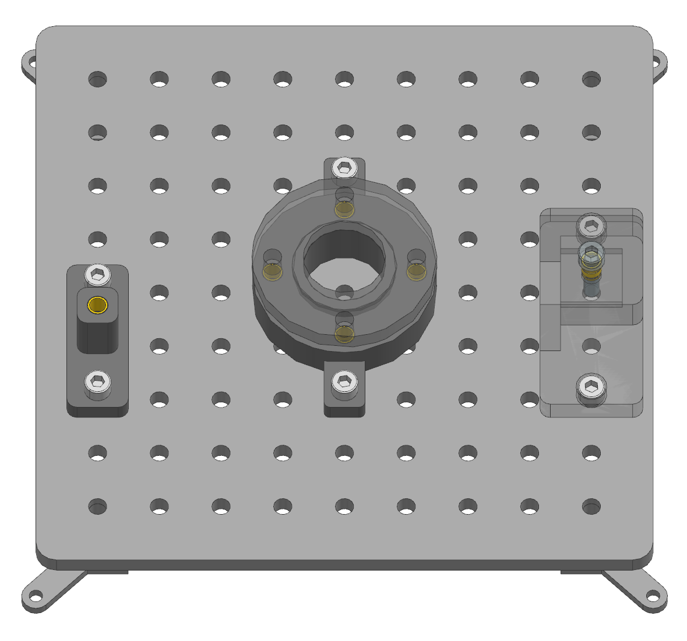

Assembly Instructions: Screws and Nuts
======================================

This section provides step-by-step assembly instructions for tasks involving screws and nuts.
Each task includes the preparation of components, manual assembly steps, and fixation on the taskboard.
Note that the assembly of this task requires a soldering iron to insert thread inserts into the 3D-printed parts.

    :alt: Screws and Nuts Task Module
    :align: center
    :width: 400px

Task 1: Hexagon Socket Screw
----------------------------

Step 1: Prepare the Components
^^^^^^^^^^^^^^^^^^^^^^^^^^^^^^

.. list-table::
    :header-rows: 1

 * - 3D-printed parts:
 - Purchased components:
 * - Screw Assembly × 1 (Material: PETG)
 - 30mm M8 Screw × 2
 * -
 - 20mm M8 Screw × 1
 * -
 - M8 Nut × 2
 * -
 - M8 Thread Insert × 1

Step 2: Manual Assembly of the Hexagonal Socket Screw Task
^^^^^^^^^^^^^^^^^^^^^^^^^^^^^^^^^^^^^^^^^^^^^^^^^^^^^^^^^^

Place the Thread Insert over the hole of the Screw Assembly part, ensuring that the smaller diameter is on the bottom side.
Proceed with the following steps:

#. Heat the insert – Use a soldering iron with an M8 tip that fits into the insert. Heat the insert until it reaches a temperature where it can melt the surrounding plastic.
#. Press the insert in – Gently apply pressure to push the insert into the hole while the plastic softens and conforms around it.
#. Allow cooling – Once in place, let the plastic cool and solidify, ensuring a strong mechanical bond.

    :alt: Screw Assembly
    :align: center
    :width: 200px

Step 3: Manual Fixation of the Assembly on the Taskboard
^^^^^^^^^^^^^^^^^^^^^^^^^^^^^^^^^^^^^^^^^^^^^^^^^^^^^^^^

Align the two side holes of the Assembly component with two corresponding holes on the Taskboard of your choice. Insert two 30mm M8 screws through the aligned holes and secure them from the bottom of the Board with M8 nuts.
Additionally, place the 20mm M8 screw on a horizontal surface next to the board, ensuring it is positioned so that the robot can grasp it.

Task 2: Nut Assembly with Difficult Accessibility
-------------------------------------------------

Step 1: Prepare the Components
^^^^^^^^^^^^^^^^^^^^^^^^^^^^^^

.. list-table::
    :header-rows: 1

 * - 3D-printed parts:
 - Purchased components:
 * - Nut Assembly × 1 (Material: PETG)
 - M8 Nut × 3
 * -
 - 30mm M8 Screw × 3
 * -
 - M8 Thread Inserts × 1

Step 2: Manual Assembly of the Nut Assembly Task
^^^^^^^^^^^^^^^^^^^^^^^^^^^^^^^^^^^^^^^^^^^^^^^^

Place the Thread Insert over the central hole on the top of the Nut Assembly part, ensuring that the smaller diameter is on the bottom side.
Proceed with the following steps:

#. Heat the insert – Use a soldering iron with an M8 tip that fits into the insert. Heat the insert until it reaches a temperature where it can melt the surrounding plastic.
#. Press the insert in – Gently apply pressure to push the insert into the hole while the plastic softens and conforms around it.
#. Allow cooling – Once in place, let the plastic cool and solidify, ensuring a strong mechanical bond.

Next, screw a 30mm M8 screw into the thread insert.

    :alt: Nut Assembly
    :align: center
    :width: 200px

Step 3: Manual Fixation of the Assembly on the Taskboard
^^^^^^^^^^^^^^^^^^^^^^^^^^^^^^^^^^^^^^^^^^^^^^^^^^^^^^^^

Align the two side holes of the Nut Assembly component with two suitable holes on the Taskboard. To ensure the robot has sufficient clearance for the Nut Assembly Task, the component should be mounted in a way that leaves the open side unobstructed. Mounting it on the side of the Taskboard ensures that the accessibility is not more difficult than intended.
Insert two 30mm M8 screws through the aligned holes and secure them from the bottom of the Board with M8 nuts.
Additionally, place the M8 screw on a horizontal surface next to the board, ensuring it is positioned for the robot to grasp.

Task 3: Multiple Screws with the Risk of Tilting
------------------------------------------------

Step 1: Prepare the Components
^^^^^^^^^^^^^^^^^^^^^^^^^^^^^^

.. list-table::
    :header-rows: 1

 * - 3D-printed parts:
 - Purchased components:
 * - Screws Tilting Part1 × 1 (Material: PETG)
 - M8 Nut × 2
 * - Screws Tilting Part2 × 1 (Material: PETG)
 - 30mm M8 Screw × 2
 * -
 - 20mm M8 Screw × 4
 * -
 - M8 Thread Insert × 4

Step 2: Manual Assembly of the Hexagonal Socket Screw Task
^^^^^^^^^^^^^^^^^^^^^^^^^^^^^^^^^^^^^^^^^^^^^^^^^^^^^^^^^^

Put the 4 thread inserts into the middle holes of the Screws_tilting_part1 part, ensuring that the smaller diameter is on the bottom side.
Proceed with the following steps for each of the four thread inserts:

#. Heat the insert – Use a soldering iron with an M8 tip that fits into the insert. Heat the insert until it reaches a temperature where it can melt the surrounding plastic.
#. Press the insert in – Gently apply pressure to push the insert into the hole while the plastic softens and conforms around it.
#. Allow cooling – Once in place, let the plastic cool and solidify, ensuring a strong mechanical bond.

Then place the Screws Tilting Part 2 on top of Part 1 lining up with the holes, that have the thread inserts. Step 3: Manual Fixation of the Assembly on the Taskboard Align the two side holes of the Screws Tilting Part 1 with two suitable holes on the Taskboard. Insert two 30mm M8 screws through the aligned holes and secure them from the bottom of the Board with M8 nuts.
Additionally, place the four 20mm M8 screws on a horizontal surface next to the board, ensuring they are positioned for the robot to grasp.

    :alt: Screws Tilting Assembly
    :align: center
    :width: 400px

