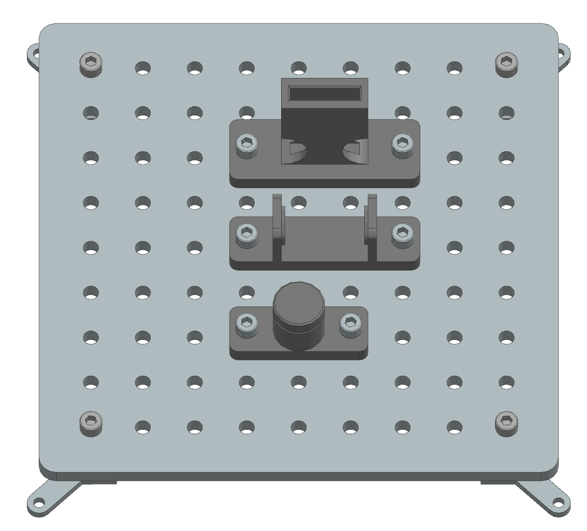
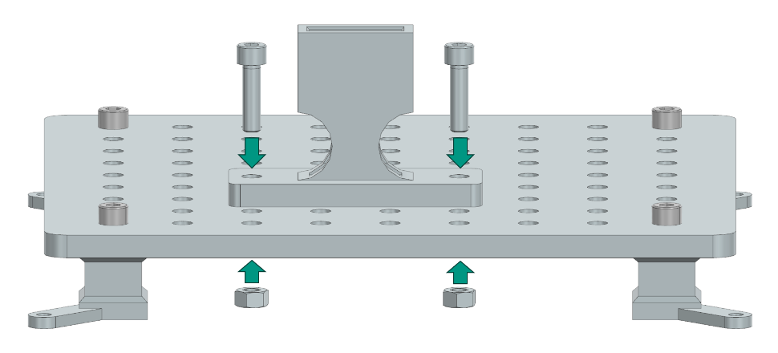

Assembly Instructions: Elastic Deformation
==========================================

This section provides step-by-step instructions for assembling the Elastic Deformation task module of the Industrial Assembly Task Board. 
The module consists of three tasks: Snap Hook, Spring, and Circlip.

Task 1: Snap Hook
-----------------

Step 1: Prepare the Components
^^^^^^^^^^^^^^^^^^^^^^^^^^^^^^

.. list-table::
    :header-rows: 1

    * - 3D-printed parts
      - Purchased components
    * - Snap Hook × 1 (Material: PETG)
      - M8 Nut × 2
    * - Snap Hook Assembly × 1 (Material: PETG)
      - 30mm M8 Screw × 2

Step 2: Manual fixation of the housing on the Task-Board
^^^^^^^^^^^^^^^^^^^^^^^^^^^^^^^^^^^^^^^^^^^^^^^^^^^^^^^^

Align the two holes on the side of the Snap Hook Assembly component with any two suitable holes on the Taskboard. Then push two 30mm M8 screws through the aligned holes and secure them from the bottom of the Taskboard with M8 nuts.

Place the Snap Hook on a flat surface next to the Taskboard so that the Robot can grasp it.

Task 2: Spring
--------------

Step 1: Prepare the Components
^^^^^^^^^^^^^^^^^^^^^^^^^^^^^^

.. list-table::
    :header-rows: 1

    * - 3D-printed parts
      - Purchased components
    * - Pressure Spring Assembly × 1 (Material: PETG)
      - M8 Nut × 2
    * -
      - 30mm M8 Screw × 2
    * -
      - Spring WF20-80 × 1

Step 2: Manual fixation of the housing on the Task-Board
^^^^^^^^^^^^^^^^^^^^^^^^^^^^^^^^^^^^^^^^^^^^^^^^^^^^^^^^

Align the two holes on the side of the Pressure Spring Assembly component with any two suitable holes on the Taskboard. Then, push two 30mm M8 Screws through the aligned holes and secure them from the bottom of the Taskboard with M8 Nuts.
Place the Spring on a flat surface next to the Taskboard to allow the robot to grasp it.

Task 3: Circlip
---------------

Step 1: Prepare the Components
^^^^^^^^^^^^^^^^^^^^^^^^^^^^^^

Step 2: Manual fixation of the housing on the Task-Board
^^^^^^^^^^^^^^^^^^^^^^^^^^^^^^^^^^^^^^^^^^^^^^^^^^^^^^^^

Align the two holes on the side of the Circlip Assembly component with any two suitable holes on the Taskboard. Then push two 30mm M8 screws through the aligned holes and secure them from the bottom of the Taskboard with M8 nuts.
Place the circlip on a flat surface next to the Taskboard to allow the robot to grasp it.

.. list-table::
    :header-rows: 1

    * - 3D-printed parts
      - Purchased components
    * - Circlip Assembly × 1 (Material: PETG)
      - M8 Nut × 2
    * -
      - 30mm M8 Screw × 2
    * -
      - 30 Circlip × 1
