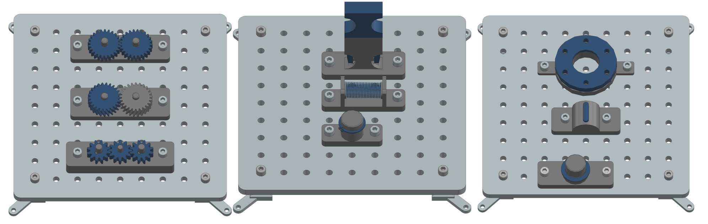

Welcome to the documentation for the *Industrial Assembly Task Board*, 
a modular robotic benchmark developed by the wbk Institute of Production Science at Karlsruhe Institute of Technology. 
This resource provides comprehensive instructions for constructing the task board hardware and detailed guidelines for evaluating robotic systems
on a variety of benchmark tasks. 
Whether you are referencing this material online or as a compiled document, 
you will find all necessary information to build, configure, and utilize the task board for research, development, or benchmarking purposes.

Why This Task Board?
---------------------

Robotic assembly is far more complex than the basic "peg-in-hole" tasks often used in benchmarks like the NIST taskboard. 
While such benchmarks are valuable, they assume that the only thing more complex than a simple peg-in-hole task is the geometry of the peg and hole,
or the manipulation of cables and belts.
In reality, industrial assembly tasks involve a wide range of challenges, including precise tolerances, compliant assembly, 
and the need for advanced planning and adaptability since different parts of an assembly may interact in unexpected ways.

The goal of this task board is to provide a set of tasks that showcases these additional complexities encountered in industrial practice.
These tasks are designed to challenge robotic agents with scenarios that require advanced planning, precision, and adaptability. 
The modular design of the board allows users to mix and match tasks depending on the specific complexities they wish to address.

We provide all 3D-printable files in this repository for anyone to build their own task boards: https://github.com/WBK-Robotics/industrial-assembly-taskboard

.. note::

   This task board is not intended to be a complete benchmark for all aspects of robotic assembly. 
   Instead, it serves as a starting point for exploring the complexities of industrial assembly tasks.
   We encourage users to extend the task board with their own modules and tasks that reflect real-world challenges.
   If you have ideas for new tasks, please contribute by opening a Pull Request with your files and task descriptions.

What you’ll find here
---------------------

This documentation is split into two main sections:

* **Assembly Guide** – step‑by‑step hardware build instructions (3D‑printing,
  purchased fasteners, mounting sequence).

* **Robot Task Guide** – formal task definitions (motion sequence, tolerances and
  success criteria) for benchmarking your robot or algorithm on each module.

.. note::

   If you are new to the benchmark, follow the quick‑start steps below. Power
   users can jump directly to the Assembly or Robot Task guides via the sidebar.

Quick‑Start
~~~~~~~~~~~

1. Read the :doc:`wbk_challenge_overview` to build the base taskboard and all
desired task modules.

2. Choose a module and open its page in the :doc:`wbk_challenge_robot_tasks_overview`
to understand the robot motions and evaluation metrics.

3. Implement your robot program, run experiments, and compare results!

Contents
--------

.. toctree::
   :maxdepth: 1
   :caption: Guides

   wbk_challenge_overview
   wbk_challenge_robot_tasks_overview
