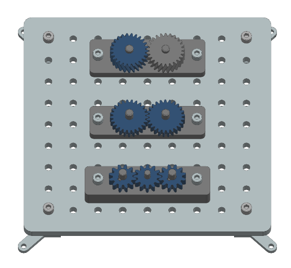
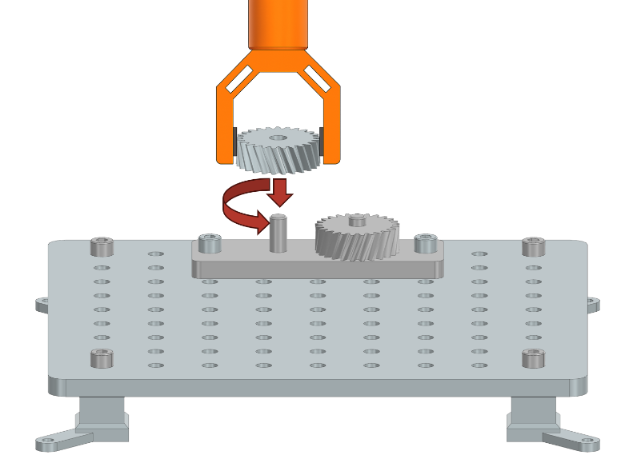

Robotic Task Descriptions: Gear Assembly
========================================

This section describes the tasks related to gear assembly on the industrial assembly task board.
These tasks require the robot to handle various gear configurations, ensuring proper alignment, meshing, and seating of the gears on their respective shafts.
The following image provides an overview of a task board with all three gear assembly tasks completed successfully.

Task 1: Two Gears
-----------------

Description:
^^^^^^^^^^^^

Two spur gears must be mounted onto parallel shafts of an assembly component so that their teeth mesh correctly. 
The gears are initially placed on a flat surface next to the Taskboard. 
The robot must ensure that the gears are positioned such that their teeth engage without interference and that each gear is fully seated on its respective shaft.
This task is basically a 3D printable version of the gear assembly task from the NIST assembly challenge.

.. image:: images/gear_assembly_taskboard_two_gears.png
    :alt: Gear Assembly Task Module - Two Gears
    :align: center
    :width: 400px

Test Objective:
^^^^^^^^^^^^^^^

This task evaluates the robot's ability to recognize gear orientation, align mounting holes with the shafts, and ensure proper meshing between gears. 

Success Criteria:
^^^^^^^^^^^^^^^^^

- Both gears are mounted onto the shafts with their teeth properly engaged.
- The gears are fully seated on the assembly component, with no visible gaps.
- The teeth of the two gears mesh without interference and can rotate together.

Task 2: Gear with Helical Teeth
-------------------------------

Description:
^^^^^^^^^^^^

A lot of gears in the physical world have more complicated tooth profiles than just spur gears.
This means that they cannot be inserted in a simple peg-in-hole manner.
Instead the gear must be rotated as it is lowered onto the shaft to ensure that the teeth engage correctly.
To simulate this, a helical gear with helical teeth must be mounted onto a shaft of the assembly component.
The gear is placed on a flat surface next to the Taskboard. 
Due to the helical design, the gear must be rotated as it is lowered onto the shaft to ensure the teeth engage correctly with an existing gear.

Test Objective:
^^^^^^^^^^^^^^^

This task assesses the robot's ability to handle components with non-standard tooth profiles, 
requiring simultaneous rotation and insertion. The robot must ensure that the gear is fully seated and that the helical teeth are properly engaged.

Success Criteria:
^^^^^^^^^^^^^^^^^

- The helical gear is mounted onto the shaft with its teeth correctly engaged with the mating gear.
- The gear is fully seated, with no gap between its underside and the assembly component.
- The gear remains stationary after placement and does not move when released.

Task 3: Three Gears with Grooves
--------------------------------

Description:
^^^^^^^^^^^^

Three gears—two with grooves and one without—must be mounted onto three shafts of the assembly component. 
The two grooved gears are placed on the outer shafts and must be aligned so that their grooves match the keys on the shafts. 
The third gear, which does not have a groove, is mounted on the middle shaft and must be positioned so that its teeth engage with the two outer gears.

In this task, the gear teeth are intentionally made larger than in the previous assemblies. 
This means that the robot cannot simply place the gears onto the shafts in any order and expect the teeth to mesh.
Instead, the robot must carefully plan the sequence of assembly and the orientation of each shaft and gear.
If the gears are not inserted in the correct order, or if the shafts are not rotated appropriately during assembly,
it may be impossible to mesh the teeth properly due to interference from the large teeth profiles. 
The robot must therefore coordinate the rotation of the shafts and the insertion of the gears to ensure that all teeth are able to engage correctly.

.. image:: images/gear_assembly_taskboard_three_gears.png
    :alt: Gear Assembly Task Module - Three Gears
    :align: center
    :width: 400px

Test Objective:
^^^^^^^^^^^^^^^

This task evaluates the robot's ability to recognize and align keyed components, 
coordinate the placement of multiple gears, and ensure proper meshing among all gears.

Success Criteria:
^^^^^^^^^^^^^^^^^

- All three gears are mounted onto their respective shafts with correct alignment.
- The grooves of the outer gears are aligned with the shaft keys.
- The teeth of all gears are properly engaged, and the gears are fully seated on the assembly component.
- The underside of each gear is in contact with the component surface, and all gears remain stationary after placement.
